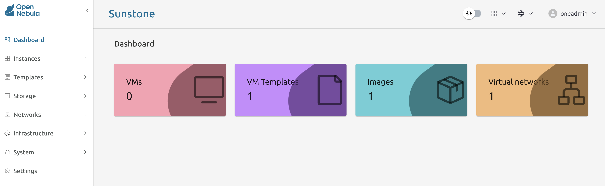

# Module 1 - Lab 1 : Prepare your Lab Environment using miniONE 
    
---
<br>
    
## Objective(-s):
- Install OpenNebula and Hypervisor using miniONE tool.
- Login into the Sunstone interface.
    
---
<br>
    
### Install OpenNebula and Hypervisor using miniONE tool.

---
<br>

#### 1.1.1

Fill in <a href="https://opennebula.io/get-minione/" target="_blank">this form to get the link to download miniONE.</a>

Copy the **minione** to any location on your Linux server that you had allocated for this task. 

In this guide we are going to assume that it is stored under the **/deployment** directory.

---
<br>
    
#### 1.1.2

You supposed to perform the installation with **root** user privileges!

Set the password for **oneadmin** user to any string, however in this guide we are going to assume that the  password is set to **Pa$$w0rd**.

```
# cd /deployment
# bash minione --password 'Pa$$w0rd' --force --yes
```

Wait until the script is going to finish (~10m).

---
<br>
    
#### 1.1.3

Access the Sunstone interface on port 80/tcp and login as **oneadmin**.


    
---
<br>
    
## Congratulations, you've completed the assignment!